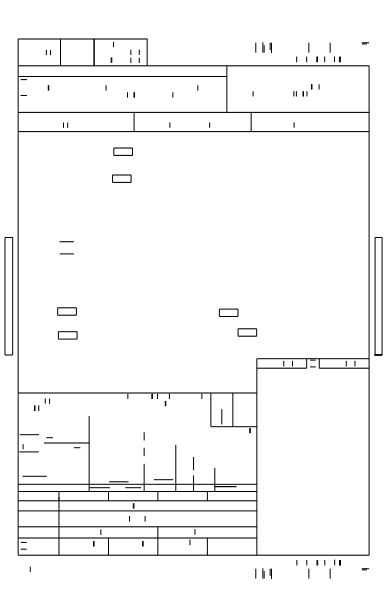
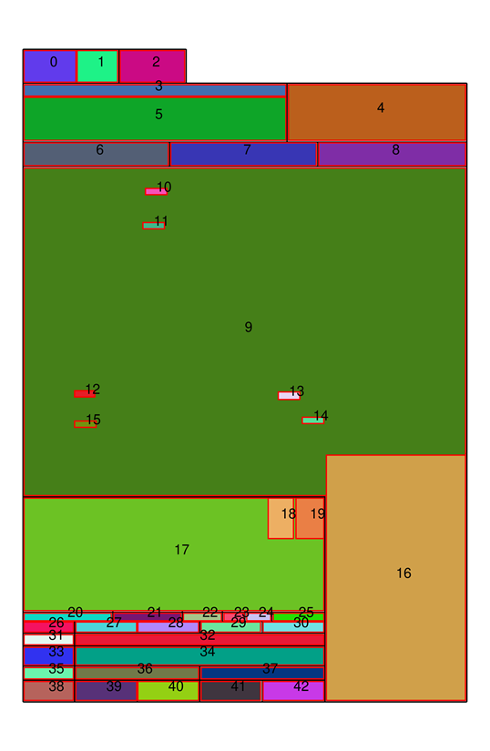

# Instrument Approach Database

Database of instrument approaches generated from parsing FAA Approach plates.

## Why not use CIFP?

As neat as the free FAA [CIFP](https://www.faa.gov/air_traffic/flight_info/aeronav/digital_products/cifp/download/)
is, it lack some approaches in the `Not_In_CIFP.xlsx` (random internet comment
said these are ones which the FAA has not certified to meet the ARNIC424
standards).

It also lacks some vital information such as the approach minimums. As per an
aeuronautical inquiry, the FAA confirmed the CIFP does not have minimums and
said that they do not offer approach minimums for download in any electronic
format.

Also, as far as I can tell, the CIFP is not a master information source for
approaches either. The master is encoded textually as part of Form 8260-x, e.g
`Form FAA 8260-3 - ILS Standard Instrument Approach Procedure` and are not
available to the public.

CIFP and approach plates are likely derived from this. The Form 8260 is a truly
cursed thing, you can view one here: https://www.faa.gov/aero_docs/acifp/2015121527331001001-SFO/CA_KSFO_ILS%20OR%20LOC%20RWY%2028LSAC2_A25A_F.PDF
(Also present in test_data folder.)

## Parsing Details

1. Draw just straight lines and rectangles from the PDF. This provides a basic
   tabular structure.

   

2. Segment the lines/rectangles into different areas based on relative sizes.
   This includes areas such as the missed approach instructions, runway/airport
   information, plan view, communication boxes, profile box, minimums etc.

   

3. Extract information from each segmented area such as the minimums.

## Development

Run tests with `python -m pytest`

### Notes:

[Avare](https://github.com/apps4av/avare?tab=readme-ov-file) does geo-referenced
plates. Useful for if we end up showing a map.
